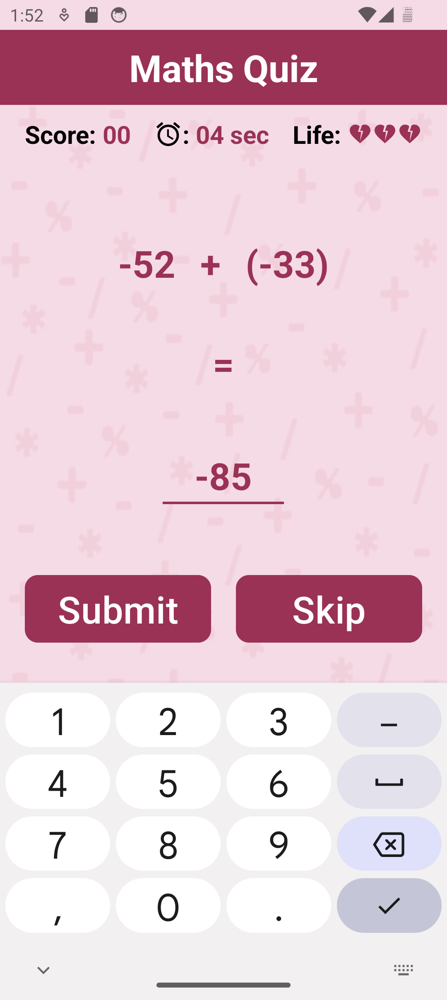
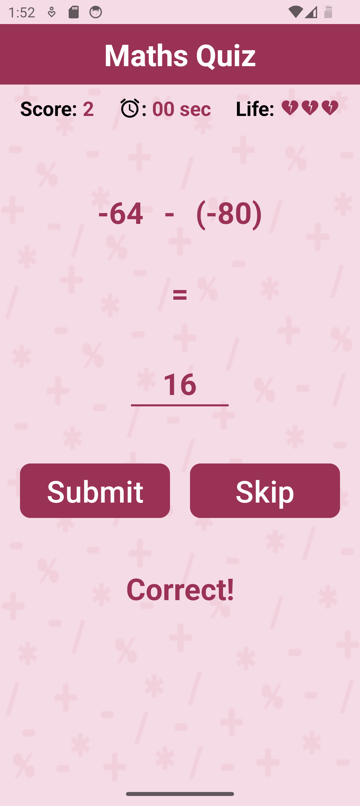
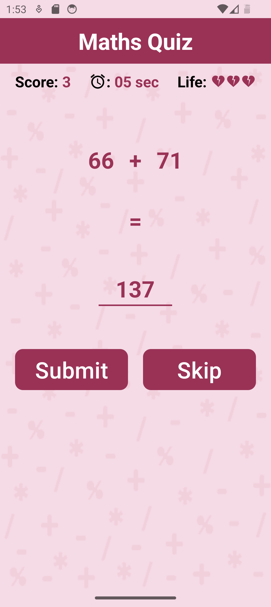
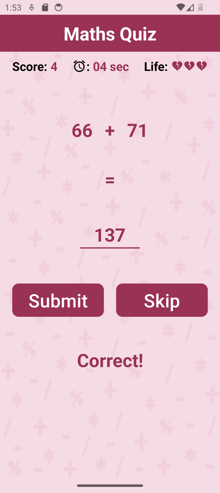
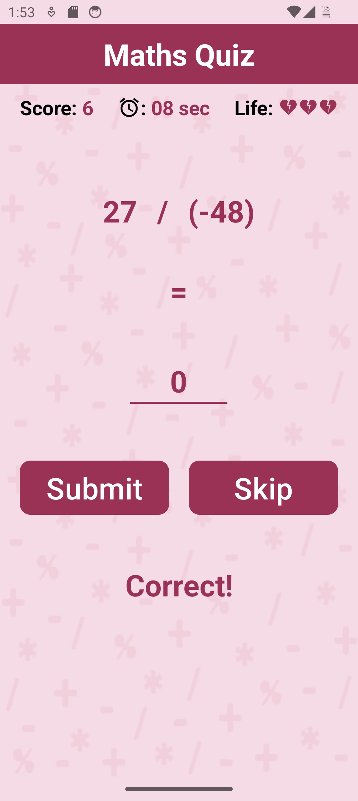
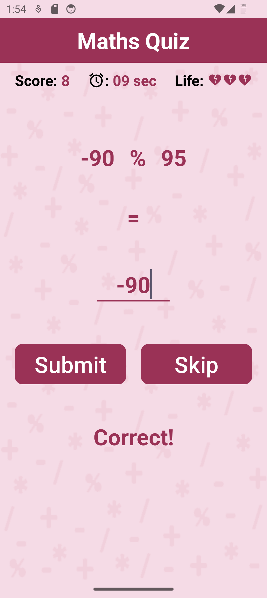
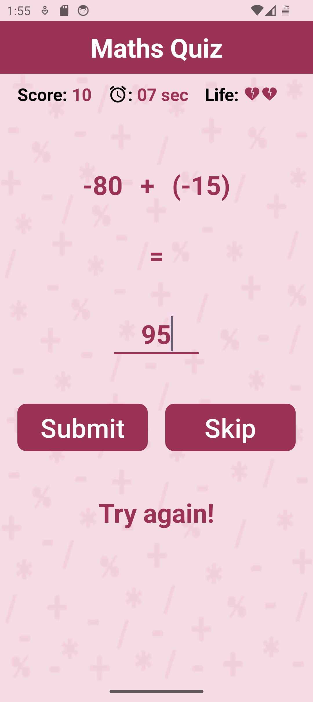
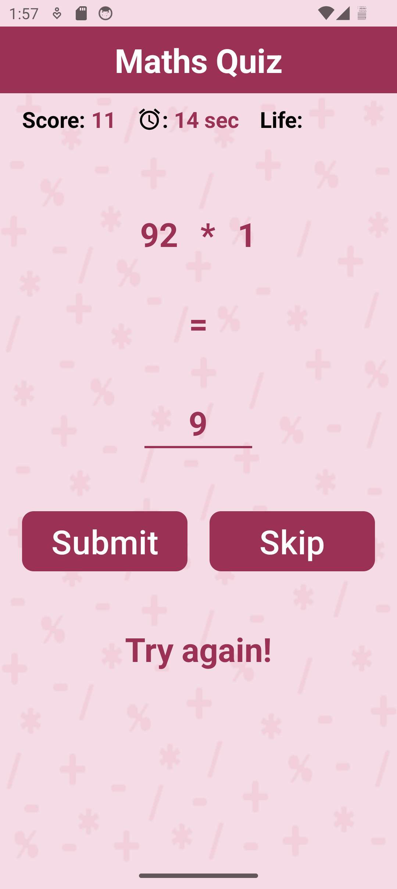
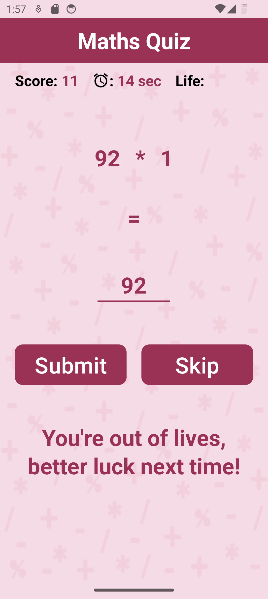

# Maths Quiz

Maths Quiz is an interactive quiz application designed to test your mathematical skills and knowledge. It offers a variety of randomized arithmetic problems, providing users with a fun and educational experience.

## Features

- **Random Problem Generation**: The app generates random numbers between 0 and 100, using `Random Module`, for arithmetic problems, ensuring a varied experience with each playthrough.
- **Time-Based Gameplay**: Users have 20 seconds to solve each math problem, making the quiz fast-paced and engaging.
- **Lives System**: Players start with 3 lives. Each incorrect or missed answer results in the loss of a life, and the game ends when all lives are lost.
- **Final Score Screen**: After the quiz, users are taken to a screen displaying their final score, with options to play again or exit the app.
- **Submit and Skip Buttons**: Users can submit their answers with a "Submit" button or skip to the next question if they cannot solve the current one.
- **Material Design and Responsiveness**: The UI follows Material Design guidelines, ensuring a clean and consistent appearance across various devices and screen sizes.
- **Theme Support**: The app supports both light and dark themes. The UI remains the same in both themes but ensures compatibility with different system preferences.
- **Bug Handling and Improvements**: Ongoing efforts to fix bugs related to the timer function to enhance the gameplay experience.

## Technologies Used

- **Android SDK**
- **Java**
- **XML for UI Design**
- **Gradle for Build Management**

## Gameplay

1. Launch the application.
2. Solve randomly generated math problems within the time limit.
3. Keep track of your lives and try to achieve the highest score possible.
4. After losing all lives, review your final score and choose to play again or exit.

## Performance and Challenges

The Maths Quiz app successfully provided an engaging and challenging experience for users through its core functionality, including:

- **Smooth Question Handling**: The app's ability to generate and manage arithmetic problems worked smoothly, keeping users engaged with fresh challenges.
- **Timer Functionality**: Although the timer added an exciting dimension to the quiz, some bugs occasionally caused inconsistencies with resetting or pausing. These issues are currently being addressed.
- **Feedback and Transition**: The app provides immediate feedback after each question, and upon losing all lives, it efficiently navigates to a results screen with options to replay or exit.

## Future Enhancements

- **Complex Calculations**: Implement features to handle more advanced mathematical operations and functions.
- **Calculation History**: Add a feature to keep track of previous calculations for user convenience.
- **Clear Instructions**: Introduce rules or instructions for players to enhance understanding of the game.
- **Play/Pause Button**: Allow users to pause the quiz for flexibility.
- **Music Controls**: Integrate app music controls for an engaging experience.
- **High Score Feature**: Use SharedPreferences to store high scores and encourage user competition.

## Screenshots
  
   
   
 
 
